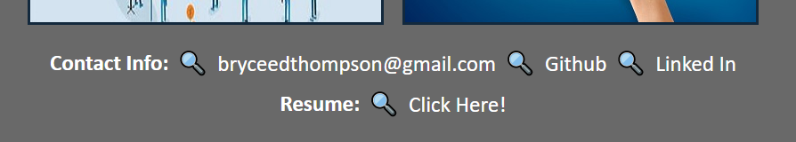

# <Portfolio>

## Description

This is my second challenge in the UCSD web dev course. The purpose of this site is to apply what I have learned in this course so far, as well as provide a place to show off the projects that I have been working on This site is a good start to my portfolio, but there is much more to add! In this case it is for the fixional company Horiseon. The main functions that I've included in my portfolio are as follows: 
- My name, a recent photo and links to different sections of the portfolio
- When you click on the links in the nav bar the UI scrolls to the corresponding section
- When you click on the link to the section about their work the UI scrolls to a section with titled images of the developer's applications
- When you are presented with the first application the application's image is larger in size than the others
- When you click on the image of the application you are taken to that application as well as haveing responsive images ex: button hover or clicking
- when you resize the page it has a responsive layout

## Installation

Open the link in my GitHub Repo!

## Usage

Here is an example of what should happen when using the nav bar.

Click on one of the 4 options.

Then it will take you to the option you chose, In this case we clicked on Contact Info. You can also click on any of the links in Contact Info and it will take you to the corrisponding site or messenger app.

Here is an example of what should happen when using the Work section.

Click on one of the 5 options. In this case we are overing over Horiseon and when we click it it will open an new tab and take us to the site .

## Credits

- https://developer.mozilla.org/en-US/docs/Web/HTML/Element

- https://css-tricks.com/a-complete-guide-to-links-and-buttons/#aa-a-jump-link

- https://www.w3schools.com/

- https://coding-boot-camp.github.io/full-stack/github/professional-readme-guide

- https://www.youtube.com/watch?v=R6euByfGaN4

- https://www.w3docs.com/snippets/html/how-to-create-an-html-button-that-acts-like-a-link.html

- https://www.w3schools.com/htmL/html_images_background.asp

- https://css-tricks.com/snippets/css/a-guide-to-flexbox/